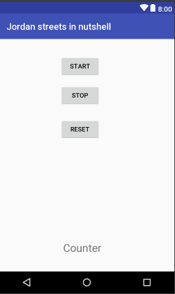
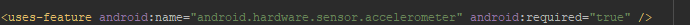

# Shake detection Android Application

This is an Android project that detect the road bumps and shakes using the accelerometer in the phone .

## Getting Started

This application is one of the many projects i built for the Android course that i took in the university , i enjoyed building each of these projects thanks to the amazing doctor that gave us this course .

The main code for this application can be found in the following path /app/src/main/java/com/example/zekkes/jordanstreetsinnutshell/MainActivity.java

For the UI , i designed a quick GUI with the following components

Once you hit Start the application will start running viewing how many shake or road bumps did it detect for now on the counter label , the Reset button will reset the counter to 0 which means that it didn't detect any shakes yet .
Finally the Stop button will stop the application ; so it stops doing any shake detection , freezing the counter label at the value it reached

### Prerequisites

You will need to modify the AndroidManifest and add the privileges manifest in order to use the accelerometer , you can find the manifest file in the following path /app/src/main/AndroidManifest.xml .
However the accelerometer permission manifest is :     

If you want to change the threshold value for the shake detection you can go to the onSensorChanged method ,and change the "if (accel > 5)" to whatever value you want .

